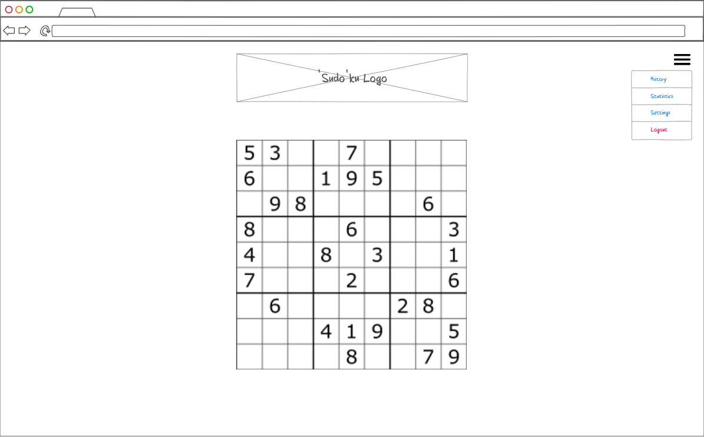
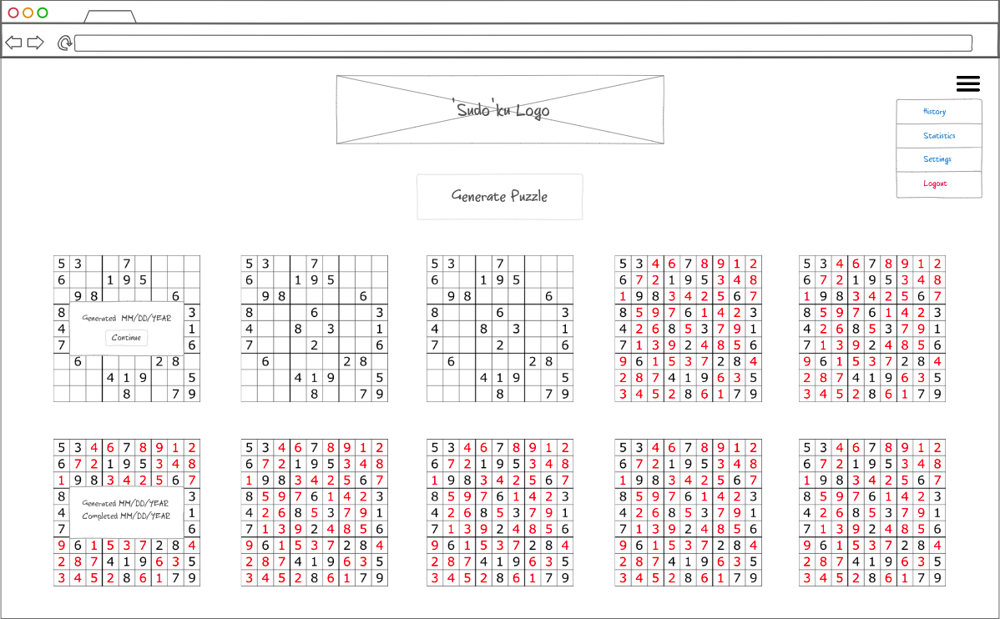
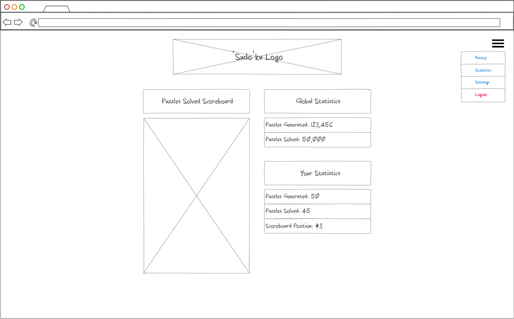

# Startup Project
BYU CS 260 Fall 2023 Startup Project for Marcus Omer

## Website Links
+ [superuserdoku.click](https://superuserdoku.click)
+ [startup.superuserdoku.click](https://startup.superuserdoku.click)
+ [simon.superuserdoku.click](https://simon.superuserdoku.click)

## Table of Contents
1. [Specification](#specification)
2. [HTML Deliverable](#html-deliverable)
3. [CSS Deliverable](#css-deliverable)
4. [Javascript Deliverable](#javascript-deliverable)

## Specification
### Pitch
The website will be a command line/terminal themed sudoku site that will let users generate, solve, and revisit sudoku puzzles. The command line/terminal theme is inspired from the "sudo" part of "sudoku", which is a reference to the `sudo` terminal command. The website will have a default dark theme and the sudoku board will be made with ASCII characters/art. 

### Key Features:
Users can generate and revisit sudoku boards by logging in with an account. To make solving sudoku puzzles more convienient, the sudoku board will highlight boxes of the board in red if the number in the box violates any sudoku rules applied to the current state of the board. The boxes that are violated by the box highlighted in red are highlighted in pink. All generated sudoku boards will have only one unique solution. Generated sudoku boards can be generated with a given difficulty. The greater the difficulty, the smaller number of given numbers on the board are given.
+ **Authentication**: The user will login with an email and password. The registered user's account is used to associate data, statistics, and finished and unfinished sudoku puzzles.
+ **Database data**: The user will have data stored in a database. This data will include how many sudoku boards the user has solved, how many sudoku boards the user has generated, which sudoku boards the user has solved, and which sudoku boards the user has started but has not solved.
+ **Websocket data**: The server will keep and send realtime data to the user. This data will include the total number of sudoku boards generated by all users, the total number of solved puzzles by all users, and a scoreboard of users with the most solved sudoku puzzles.

### Page Mocks
**Puzzle Solving Page**:

**History Page**:

**Statistics Page**:

## HTML Deliverable
+ **HTML Pages** - Created HTML pages for the login page (`index.html`), the history page (`history.html`), the statistics page (`statistics.html`), and the solve page (`solve.html`), which is where the user can solve a single sudoku puzzle. The original specification suggests that there could be a settings page, but at the moment there are not enough adjustable settings to justify an entire settings page.
+ **Links** - The login button on the login page links to the history page. The "Continue" and "Generate Puzzle" buttons link to the solve page. Each page except for the login page contains a navigation menu which links to the history page, statistics page, and the login page, which is linked to by the "Logout" option. Additionally, each page contains a link to this GitHub repo in the footer.
+ **Text** - Most of the textual content on the pages are informative labels for data or buttons. "How to Play Sudoku" instructions were added to the login page as well. These instructions could be added to the solve page in the future, if it does not clutter the page.
+ **Service Calls** - Any service calls to 3rd party services like authentication, database, etc. are currently just text and HTML input elements.
+ **Images** - The first iteration of the "superuserdoku" logo, which currently says "*sudoku*" was created using an [ASCII Art website](https://www.asciiart.eu/text-to-ascii-art) and added as an image to the header of every page. There are also placeholder images on the history page for the unsolved/solved sudoku boards.
+ **Login** - The login page contains a form with two input elements. The first is a text input element, is labeled "Email", and has the placeholder 'email@domain.com'. The second is a password input element and is labeled "Password". The "Login" button automatically takes the user to the history page.
+ **Database Data** - The sudoku boards and any user data will be stored in the database. Currently, the sudoku boards are just images and any user data on the statistics page are just text enclosed in span elements. On the solve page, the sudoku puzzle table would normally be auto filled with an incomplete board from the database. The "Dark Mode" checkbox setting might also be stored in the database to improve the users' experience.
+ **WebSocket Data** - Real-time data on the statistics page is currently just text enclosed in span elements.

## CSS Deliverable
+ **Header, footer, and main content body** - Each page contains the same formatted header and footer. The header contains the website logo image and the navigation menu icon on the left side of the screen. The footer contains my name and the link to this GitHub. The main content body heavily differs between the pages, but each page does properly balance the header, footer, and main content body.
+ **Navigation elements** - The navigation element is a hamburger menu with a fixed position at the top-left side of every page. When the nav element is clicked on, a fullscreen menu appears on top of the page. The hamburger icon changes to a close symbol using a rotate animation. The fullscreen menu contains the website logo, the navigation links, a dark mode settings Bootstrap toggle, and the footer content. To close the fullscreen menu, the user clicks on the close icon and the fullscreen menu will fade back to original page and the close icon will rotate back to a hamburger menu icon. This menu was based on a [CodePen demo](https://codepen.io/brenden/pen/VLjKMQ).
+ **Responsive to window resizing** - Every page is reponsive to window resizing. CSS media rules were used to adjust the widths, heights, and ordering of most elements to provide visually appealing fitting and scaling on fullscreen and on mobile.
+ **Application elements** - Every page contains several adjustable and formatted elements. Most elements are formatted vertically using flexboxs and divs. A grid display is also used on the History page to display the puzzles. Additionally, several elements such as tables and buttons have special styling when hovered over with a cursor. Most of the buttons also have special orange/amber coloring to make them pop out to the user.
+ **Application text content** - Text content has consistent styling across the whole website. The fonts and text colors were chosen to mimic a classic computer terminal. For example, the font family used was "Courier New", monospace, and `h2` elements were styled to be a computer terminal green. The Statistics page showcases most of the text styling.
+ **Application images** - The original header logo from the HTML Deliverable is still present and does not yet fit the visual style of the background and text. However, it's width is carefully styled to fit the page and be responsive. In the future I plan to create a new image that fits the visual style. The logo image was also added to the fullscreen menu and is also responsive. Another note, the images on the history page were removed and replaced with actual tables.

## Javascript Deliverable
+ **Support for future login** - Upon logging in, the user's email is stored in LocalStorage. In the future, this is will sent along with a password to an authentication service.
+ **Support for future database** - A Database class was created that contains static functions. These functions retrieve user and global data. For now, the user and global data is stored in LocalStorage.
+ **Support for future WebSocket** - The `statistics.js` page repeatedly updates the global data variables to mimic WebSocket behavior.
+ **Support for application's interaction logic** - Most application interaction logic exists in `puzzle.js`, `solve.js`, and `history.js`. `puzzle.js` is responsible for defining, generating, and retrieving puzzles. `solve.js` displays and provides event listeners for the sudoku table that process input and trigger animations. `history.js` generates random puzzles when the page is loaded and lets the user go the solve page. In the future, `history.js` will load puzzles from the user's history instead of generating puzzles.